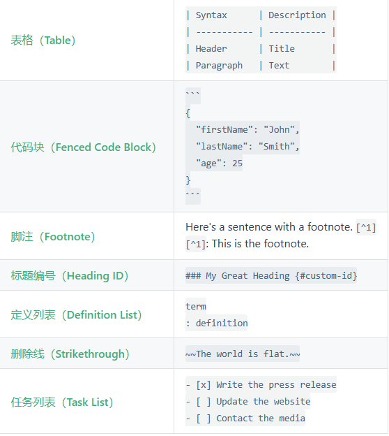

[TOC]
---
or

- [H1](#h1)
  - [H2](#h2)
    - [H3](#h3)
- [For hyperhinted](#for-hyperhinted)

`shift+ctrl+P -> markdown all in one :creat Table of contents`

---

<center><font size=8>Markdown Learning</font></center>
<center><font size=5>Author : Pakin_Wu</font></center>
<center><font size=4>2023.08.10  v0.1</font></center>

此文档用于Markdown语法学习与快速查询(比如，当你很久没用md的时候会一下子忘了加粗怎么加、图片怎么加入、列表怎么打...)

也可以用此文档来作为md的模板。

推荐用的插件（本人用到的）：
1. HyperSnips for Math    （提供强大的数学公式自动补齐功能）
2. Markdown All in one   （必需品）
3. Markdown Preview Enhanced  （可以调整显示字体大小，背景风格等）
4. Markdown PDF  （必需品）
5. paste image (不再需要了，新版VScode已经自带能够直接粘贴图片的功能了)

PS ：
- 此文档的内容并不齐全，但是应对日常笔记已经完全足够了，markdown做笔记讲究的就是一个快速 整洁 美观
- **此文档的内容可能有些混乱**，主要用于查询即可。比如突然忘记了怎么调整图片大小，下滑找到缩小的图片即可看到对应代码。
-  :dog:
-  :smile:

---

# H1


##  H2


###  H3

I really like using Markdown.

I think I'll use it to format all of my documents from now on.

---

normal text

**blod text**

*italicized text*

~~Delete~~

==highlight==   (markdowm preview enhanced)

---
(markdowm preview enhanced)
- [x] Write the press release   
- [x] Update the website
- [x] Contact the media
- [ ] 可以在pdf上点的
- [ ] ...

---


1. First item
    1. sub item 
    2. sub item 
        - subsub
        - subsub
        - ...
    3. sub item 
2. Second item
3. Third...
---
- item
- item
- item

---

> blockquote

---

`code sample: #include <stdio.h>...`

```json
{
  "firstName": "John",
  "lastName": "Smith",
  "age": 25
}
```
or
```c++
{
  "firstName": "John",
  "lastName": "Smith",
  "age": 25
}
```

---

[Markdown Learning](https://markdown.com.cn/)

https://markdown.com.cn/

REF : [教程向: 在 VS Code 中用 Markdown 做「数字化」学习笔记(B乎)](https://zhuanlan.zhihu.com/p/366596107)（本人已收藏的文章，在此推荐一下）

---



<div align=center> 
 
 
 
</div>

---

| Syntax      | Description | Test Text     |
| :---        |    :----:   |          ---: |
| Header      | Title       | Here's this   |
| Paragraph   | Text        | And more      |

---


---

:joy:   表情包对应代码可以google，一般不怎么用。

行内公式用$\mu = a + b$

独立行公式用:

$$\int_{-\infty}^{\infty} x \mathrm{d}x$$ 

$$
\begin{cases}
x=\rho\cos\theta \\
y=\rho\sin\theta \\
\end{cases}
$$

# For hyperhinted
以下是HyperSnips for Math这个插件相关用法，具体用法请google

Tips：按下 Tab 键可以跳转光标。VScode中ctrl + Enter 可跳过后续直接换行。

按下快捷键 Ctrl + Shift + P, 输入命令 Open Snippets Directory, 就可以打开一个文件夹，打开 markdown.hsnips,可以在里面查询或修改对应替换方式.

-  1/      -->   $\frac{1}{2}$
-  //      -->   $\frac{..}{..}$
-  xsr     -->   $x^{2}$  (square)
-  xtp     -->   $x^{..}$ (Th power)
-  hsq     -->   $\sqrt{..}$ (hyperhinted sqrt)
-  x1      -->   $x_1$
-  xii      -->   $x_i$
-  xsb     -->   $x_{..}$  (sub)
-  
-  sum     -->   $\sum_{n=1}^{\infty} $
-  prod    -->   $\prod_{n=1}^{\infty} $
-  int     -->   $\int $
-  dint    -->   $\int_{-\infty}^{\infty}  \mathrm{d}x$
-  ali     -->   $\begin{aligned}
x+y=z \\
z+b=c \\
\end{aligned}$
-  case    -->   $\begin{cases} x+y=z,x=0 &  \\ a+b=c, c=2&  \end{cases}$
-  
-  vec2    -->   $\begin{bmatrix} x_1 \\ x_2 \\\end{bmatrix}$
-  vecC    -->   $\begin{bmatrix} x_1 \\ x_2 \\ \vdots \\ x_n \end{bmatrix}$
-  vecR    -->   $\begin{bmatrix} x_1, x_2, \cdots, x_n \end{bmatrix}$
-  bmat    -->   $\begin{bmatrix} x_1 & x_2 \\ x_3 & x_4 \\\end{bmatrix}$
-  alpha   -->   $\alpha$ (All of that,e.g. sigma mu ...)
-  **      -->   $\cdot $
-  xx      -->   $\times $
-  otimes  -->   $\otimes $
-  <=,>=.!=.==,~~     -->   $\le ,\ge ,\neq ,\equiv ,\approx $
-  bec,thr  -->   $\because ,\therefore $
-  EE,AA,inn,sse,sqs,cap,cup  -->   $\exists ,\forall ,\in ,\subseteq ,\cap ,\cup $
-  empty    -->   $\empty$
-  oo      -->   $\infty$ (NB!)
-  lim     -->   $\lim_{n \to \infty}$
-  dd      -->   $\mathrm{d}$
-  part    -->   $\frac{\partial V}{\partial x}$
-  diff    -->   $\frac{\mathrm{d}y}{\mathrm{d}x}$
-  2diff    -->   $\frac{\mathrm{d}^2y}{\mathrm{d}x^2}$
-  
-  RR,NN,txt     -->   $\mathbb{R},\mathbb{N},\text{...},$
-  xbar,xhat,xhvec,xhdot     -->   $\bar{x},\hat{x},\vec{x},\dot{x},$
-  Xbb,Xbs,Xbm,Xbf,Xsf --> $\mathbb{X},\boldsymbol{X},\bm{X},\mathbf{X}$
-  Xcal,Xfrak,Xrm    -->   $\mathcal{X},\mathfrak{X},\mathrm{X}$
-  


